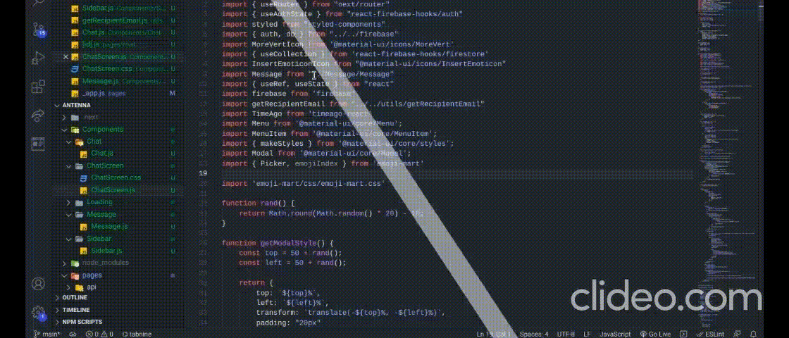

<h1 align='center'>Antenna</h1>

<p align='center'></p>

<p>Antenna is a 1-to-1 messaging app. It allows the users to enter the email of the person whom he/she wants to send a message. This app will also show the last seen of the person and also the time of the message. More details are shown in the working screenshot</p>

### Setting Up in Local System
1. Clone this repository - ```git clone https://github.com/pranjals149/Antenna.git```
2. Move into the project directory - ```cd Antenna```
3. Install the required dependency - ```npm install```
4. Now, run the server - ```npm run dev```
5. The local server is started.

### Working Screenshot


**Hope you like it !!**